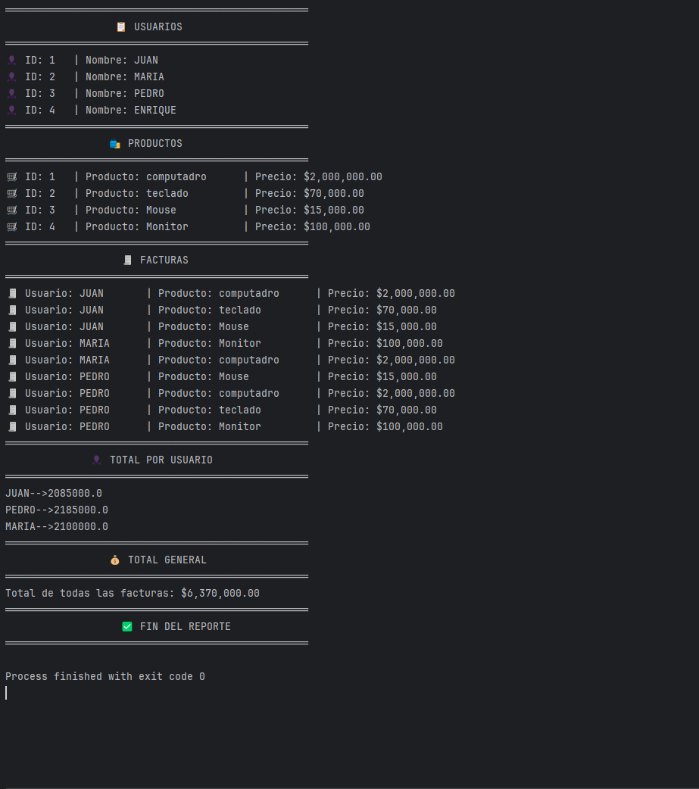

# 🧾 Sistema de Facturación en Java

Este proyecto es un sistema de facturación desarrollado en Java que permite gestionar usuarios, productos y facturas. Utiliza conceptos avanzados de Java como **expresiones lambda**, **listas**, **interfaces**, **clases estáticas** y **programación orientada a objetos**.

---

## 🚀 Funcionalidades

- **👥 Gestión de usuarios:** Agregar y listar usuarios.
- **🛒 Gestión de productos:** Agregar y listar productos.
- **🧾 Gestión de facturas:** Generar facturas asociando usuarios y productos.
- **📊 Reportes:** Mostrar facturas por usuario y el total de facturas generadas.

---

## 🛠️ Tecnologías y conceptos utilizados

- **λ Expresiones lambda:** Para simplificar operaciones como el filtrado y mapeo de listas.
- **📋 Listas (`List`):** Para almacenar y gestionar usuarios, productos y facturas.
- **📜 Interfaces:** Para definir contratos que deben implementar las clases.
- **⚙️ Clases estáticas:** Para métodos utilitarios que no dependen de instancias.
- **🧬 Herencia:** Para reutilizar y extender funcionalidades entre clases.
- **🧩 Programación orientada a objetos (POO):** Para modelar usuarios, productos y facturas como objetos.

---

